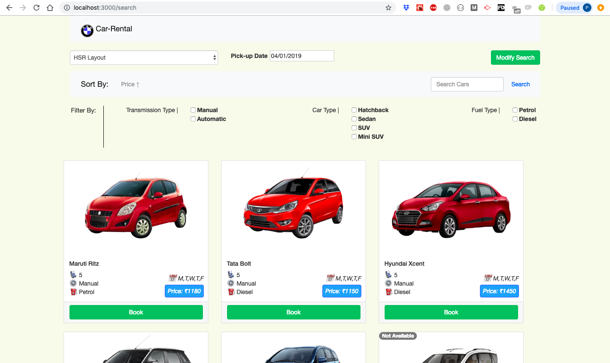

## Getting Started

1) Clone the repository

2) Go into the repository folder
		`cd car_rental`

3) Go into the project folder
		`cd car-rental`

4) Install all the dependencies
		`npm install`

5) Start the project
		`npm start`	

NOTE: Node version 9 or above is required to run the project succesfully.

Runs the app in the development mode. 
Open [http://localhost:3000](http://localhost:3000) to view it in the browser.

The page will reload if you make edits. 

## Modules

### Landing Page:

1) Select Location and Date of Pick up - 
		
		Select one of the locations of bangalore from the drop down and select a date from the datepicker

2) Submit Button - 
		
		Submit the inputs and the page redirects to searched results page of cars according to the selected criteria.

### Search Results Page:

1) Update Search criteria - 

		On the current results page, update the pickup criteria to get the new results fulfilling the criteria.

2) Sort Cars - 

		Sort resulted cars by Price on the click of a button

3) Search Cars - 

		Search car/s by name or Car Type

4) Filter Cars - 

		Filter the list of cars on the basis of Car Type, Fuel Type and Transmission Type. The Filters are exhaustive and any combination of filters can be implemented to get a more refined search of cars as per the need.

### Car Card:

		Each result is displayed as a card with all the information including, the car image, car name, seating capacity, car type, fuel type, price and availability.
		A `not available` badge is displayed if the car is unavailable on the selected day of pickup.

### Car Select: 

		As a user selects a particular car, the UI changes to reflect the selected car with a blue border on the card. Only one car can be selected at a time.

### Pagination:

		All the results from the pickup criteria, searched query and filtered cars are paginated with 6 results being the page size.
		Dynamic mounting of page count and results display on the basis of user interaction.

## Resources - 

1) create-react-app : The whole project is setup using create-react-app https://github.com/facebook/create-react-app

2) React-Bootstrap : The layout and structuring is done using react-bootstrap https://react-bootstrap.github.io/

3) React-datepicker : Date picking input field is implemented using react-datepicker https://www.npmjs.com/package/react-datepicker

4) React-Paginate : The pagination structure is integrated using React-Paginate https://www.npmjs.com/package/react-paginate

5) React Router Dom : Routing mechanism is handled by react-router-dom https://www.npmjs.com/package/react-router-dom

6) Redux and react-redux: The two have been used for the universal state management of the application https://react-redux.js.org/
